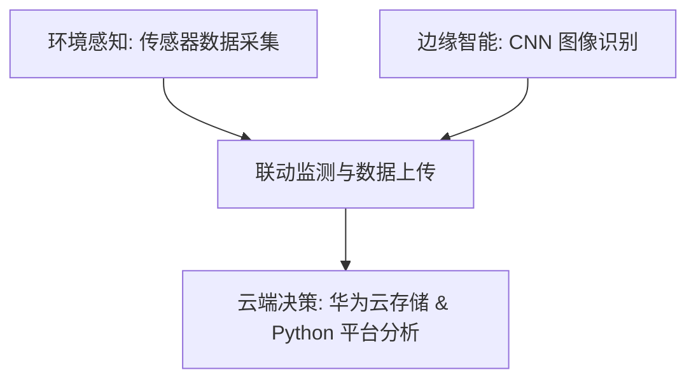

# 农眼卫士 - 小麦与茶叶病虫害智能识别与防治决策系统
系统设计与需求规格说明书

## 1. 项目概述

* **课程题目**：农眼卫士 - 小麦与茶叶病虫害智能识别与防治决策系统
* **定位**：基于物联网环境监测与边缘端 AI 图像识别技术，实现小麦与茶叶病虫害的智能识别、环境联动监测与防治决策的软硬件一体化系统。

---

## 2. 主要开发任务

本系统开发任务涵盖**环境感知**、**边缘智能**与**云端决策**三个核心维度：

1. **环境监测与数据采集**
   * 采集农田/茶园的**温湿度**、**土壤氮磷钾**、**光照强度**等环境参数。
   * 实现环境数据与病虫害发生概率的联动监测。
2. **边缘端 AI 图像识别**
   * 在边缘端运行 CNN（卷积神经网络）模型，实时识别：
     * **小麦病虫害**：锈病、白粉病。
     * **茶叶病虫害**：茶炭疽病、茶小绿叶蝉。
3. **云端存储与辅助决策**
   * 将病虫害及环境数据上传并存储至**华为云**。
   * 利用 Python 平台处理云端数据，生成病虫害防治建议及病虫害分布热力图。

---

## 3. 硬件架构与传感器配置

为满足监测和控制需求，嵌入式端建议搭载以下传感器和硬件模块：

| 模块类别 | 硬件/传感器名称 | 主要作用 |
| :--- | :--- | :--- |
| **环境感知** | 温湿度传感器 | 监测农田/茶园微气候，评估病虫害易发环境 |
| | 土壤氮磷钾传感器 | 检测土壤肥力，辅助分析作物健康状况 |
| | 亮度（光照）传感器 | 监测光照情况 |
| | 二氧化碳传感器 | 监测空气中 $CO_2$ 浓度 |
| **人机交互/警报** | 语音模块 | 用于播放现场语音警报与提示 |
| | BEEP 蜂鸣器 | 发生紧急或严重病虫害时触发声光报警 |
| | LED 指示灯 | 指示病害区域或系统状态 |
| **执行控制** | 继电器模块 | GPIO 驱动继电器，控制外部喷洒/灌溉设备 |

---

## 4. AI 智能识别与分级功能

### 4.1 图像识别分类
系统通过 CNN 图像识别模型对多类目标进行检测与分类：
* **作物病害**：
  * 小麦叶片病虫害分类（锈病、白粉病）
  * 茶叶病害识别（茶炭疽病）
* **农业害虫**：
  * 茶小绿叶蝉检测
  * 常见农业害虫（蚜虫、红蜘蛛等）识别与检测

### 4.2 病虫害程度分级
根据 CNN 识别结果，系统对病虫害进行等级划分，并输出相应的防治方案：
* **轻度 (Mild)** $\rightarrow$ 建议采取物理防治或局部预防
* **中度 (Moderate)** $\rightarrow$ 建议针对性喷洒药剂，加强监测
* **重度 (Severe)** $\rightarrow$ 触发紧急处理方案，并生成全面防治决策

---

## 5. 警报机制与控制方式

### 5.1 现场报警方式
当边缘端检测到病虫害时，系统会通过多种媒介在现场发出警报：
* **语音播报**：例如，检测到锈病时播报语音：*“检测到小麦锈病，请及时喷施农药”*。
* **声音报警**：蜂鸣器（BEEP）发出警报声。
* **视觉提示**：LED 灯光亮起，提示并定位病害发生的物理区域。

### 5.2 设备控制方式
通过 GPIO 驱动继电器，实现对现场模拟设备的自动或远程控制：
* **农药喷洒控制**：联动模拟农药喷洒设备开启/关闭。
* **模拟灌溉控制**：联动灌溉设备启停，调节环境温湿度以抑制病害蔓延。
