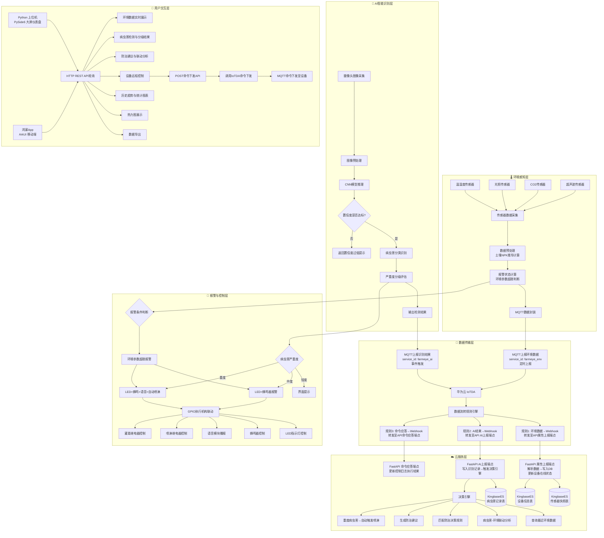
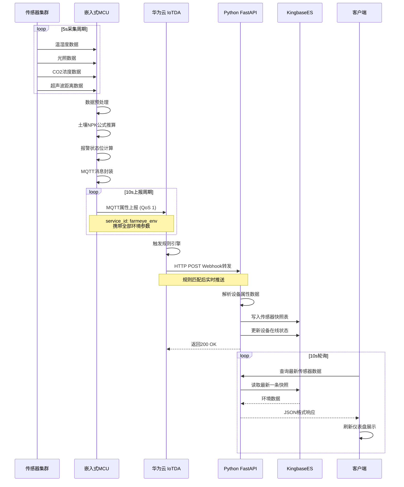
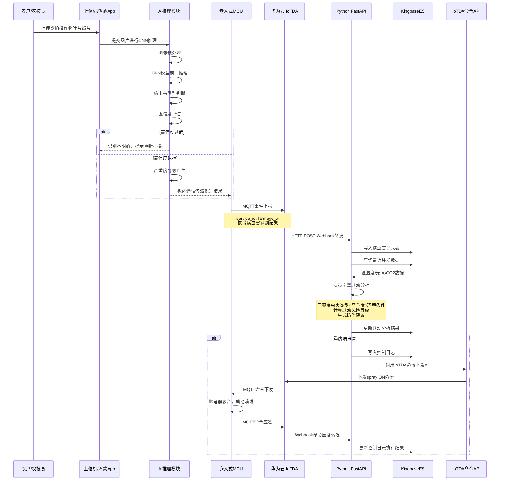
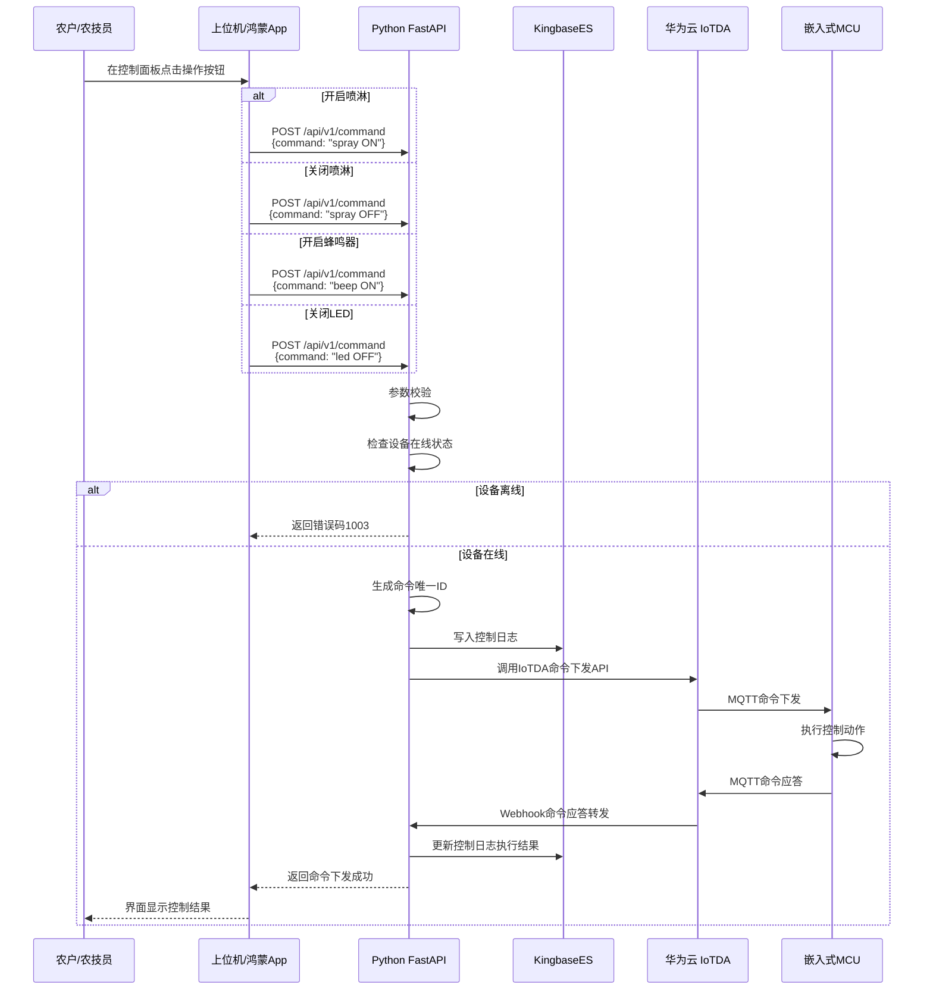
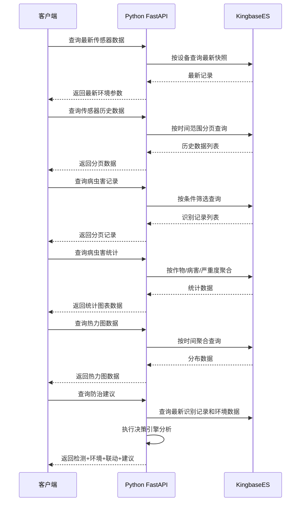

# 农眼卫士 - 业务流程图

## 1. 总体业务流程图



## 2. 环境数据采集流程（泳道图）



## 3. AI识别与防治决策流程



## 4. 手动控制设备流程



## 5. 数据查询与展示流程



## 6. 核心流程说明

### 6.1 环境监测流程
```
传感器定时采集 → MCU数据预处理 → NPK推导计算 → 
报警状态判断 → MQTT封装上报 → IoTDA规则转发 → 
API接收写入DB → 客户端轮询展示
```

### 6.2 AI识别与防治流程
```
图像采集 → CNN推理 → 病虫害分类 → 置信度评估 → 
严重度分级 → MQTT事件上报 → IoTDA转发 → 
决策引擎联动分析 → 防治建议生成 → 重度自动控制
```

### 6.3 报警控制联动
```
报警触发源：
├─ 环境参数超限（温湿度/光照/CO2/NPK）
└─ AI识别病虫害（按严重度分级）

联动执行：
├─ 轻度 → 界面提示 + LED绿色
├─ 中度 → LED黄色闪烁 + 蜂鸣器间歇 + 语音建议
└─ 重度 → LED红色闪烁 + 蜂鸣持续 + 语音紧急 + 自动喷淋
```

### 6.4 热力图生成逻辑
```
积累病虫害检测记录 → 按时间段/设备聚合 → 
统计频次与严重度分布 → 颜色映射渲染 → 
客户端展示交互式热力图
```

## 7. 异常流程处理

| 场景 | 处理方式 |
|------|---------|
| 传感器数据异常 | 标记异常值，跳过该次采集，显示"数据异常" |
| AI置信度过低 | 提示"识别不明确，建议重新拍摄" |
| MQTT连接断开 | MCU本地缓存数据，网络恢复后自动补报 |
| 设备离线 | 30秒无上报→标记离线，命令下发返回离线错误 |
| IoTDA推送重试 | API数据写入采用幂等机制防止重复记录 |
| 数据库写入失败 | 返回HTTP 500，触发IoTDA重试 |
| 命令下发失败 | 记录失败状态，返回错误码 |
| 数据导出超限 | 单次导出上限10万条，超限提示缩小范围 |
