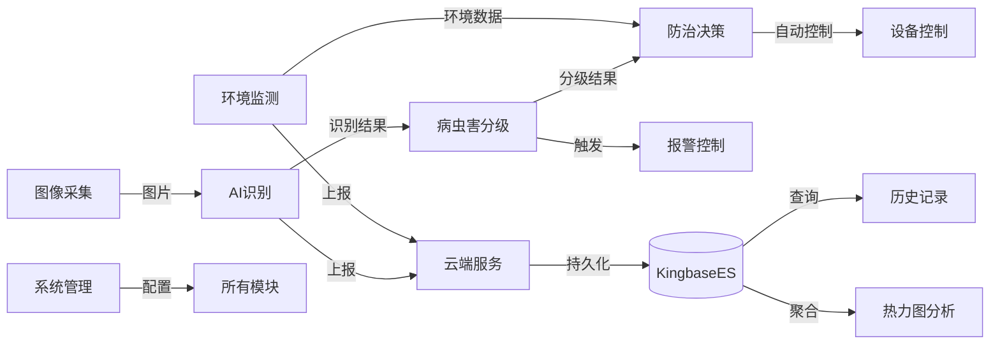

# 农眼卫士 - 功能结构图

## 1. 系统总体功能结构

```mermaid
flowchart TB
    A["农眼卫士 FarmEye Guard<br/>小麦与茶叶病虫害智能识别<br/>与防治决策系统"] --> B[环境监测模块]
    A --> C[图像采集模块]
    A --> D[AI智能识别模块]
    A --> E[病虫害分级模块]
    A --> F[防治决策模块]
    A --> G[报警控制模块]
    A --> H[设备控制模块]
    A --> I[云端数据服务模块]
    A --> J[热力图分析模块]
    A --> K[历史记录与统计模块]
    A --> L[系统管理模块]

    %% 环境监测模块
    B --> B1[温湿度采集]
    B --> B2[光照强度采集]
    B --> B3[CO2浓度采集]
    B --> B4[超声波测距]
    B --> B5[土壤NPK推导]
    B --> B6[报警状态计算]
    B --> B7[环境数据仪表盘]
    B --> B8[OLED本地显示]

    %% 图像采集模块
    C --> C1[本地图片上传]
    C --> C2[摄像头拍摄]
    C --> C3[图片预览]
    C --> C4[批量导入]

    %% AI智能识别模块
    D --> D1[小麦病害识别]
    D --> D2[茶叶病害识别]
    D --> D3[农业害虫检测]
    D --> D4[识别结果展示]

    D1 --> D1a[锈病识别]
    D1 --> D1b[白粉病识别]
    D2 --> D2a[茶炭疽病识别]
    D2 --> D2b[茶小绿叶蝉识别]
    D3 --> D3a[蚜虫检测]
    D3 --> D3b[红蜘蛛检测]
    D4 --> D4a[病害名称显示]
    D4 --> D4b[置信度展示]
    D4 --> D4c[检测区域标注]

    %% 病虫害分级模块
    E --> E1[严重程度评估]
    E --> E2[三级分级输出]
    E --> E3[分级结果可视化]

    E2 --> E2a[轻度]
    E2 --> E2b[中度]
    E2 --> E2c[重度]

    %% 防治决策模块
    F --> F1[分级防治方案推荐]
    F --> F2[农药信息查询]
    F --> F3[防治时期建议]
    F --> F4[环境-病害联动分析]
    F --> F5[防治知识库管理]

    F1 --> F1a[轻度-物理防治]
    F1 --> F1b[中度-药剂喷洒]
    F1 --> F1c[重度-紧急处置]

    %% 报警控制模块
    G --> G1[语音播报报警]
    G --> G2[蜂鸣器报警]
    G --> G3[LED灯光提示]
    G --> G4[环境阈值报警]
    G --> G5[报警阈值配置]
    G --> G6[报警日志记录]

    G3 --> G3a[绿色-正常]
    G3 --> G3b[黄色闪烁-中度]
    G3 --> G3c[红色闪烁-重度]

    %% 设备控制模块
    H --> H1[继电器控制]
    H --> H2[喷淋设备控制]
    H --> H3[灌溉设备控制]
    H --> H4[LED开关控制]
    H --> H5[蜂鸣器开关控制]
    H --> H6[设备在线监控]
    H --> H7[命令日志追踪]

    H1 --> H1a[自动触发]
    H1 --> H1b[手动远程]

    %% 云端数据服务模块
    I --> I1[华为云IoTDA连接]
    I --> I2[MQTT属性上报]
    I --> I3[Webhook数据流转]
    I --> I4[设备影子管理]
    I --> I5[命令下发网关]

    I2 --> I2a[环境数据上报]
    I2 --> I2b[AI结果上报]
    I3 --> I3a[传感器规则转发]
    I3 --> I3b[AI规则转发]
    I3 --> I3c[命令应答转发]

    %% 热力图分析模块
    J --> J1[病虫害数据聚合]
    J --> J2[热力图生成]
    J --> J3[热力图交互]
    J --> J4[防治报告生成]

    %% 历史记录与统计模块
    K --> K1[检测记录列表]
    K --> K2[环境历史曲线]
    K --> K3[统计图表分析]
    K --> K4[控制日志查询]
    K --> K5[数据导出]

    K3 --> K3a[病害分布饼图]
    K3 --> K3b[检测趋势折线图]
    K3 --> K3c[严重度分布图]

    %% 系统管理模块
    L --> L1[系统配置]
    L --> L2[API认证管理]
    L --> L3[CNN模型管理]
    L --> L4[传感器校准]
    L --> L5[系统日志]
    L --> L6[关于系统]

    L1 --> L1a[MQTT参数配置]
    L1 --> L1b[报警阈值配置]
    L1 --> L1c[数据保留策略]
```

## 2. 各模块功能详情

### 2.1 环境监测模块

| 编号 | 功能 | 说明 | 数据来源 | 采集方式 |
|------|------|------|---------|---------|
| EM01 | 温湿度采集 | 实时采集并显示环境温湿度数据 | DHT11传感器 | 定时采集 |
| EM02 | 光照强度采集 | 实时采集并显示环境光照强度 | LDR传感器 | 定时采集 |
| EM03 | CO2浓度采集 | 实时采集并显示CO2浓度 | MH-Z19C传感器 | 定时采集 |
| EM04 | 超声波测距 | 测量作物高度/水位/障碍物距离 | HC-SR04传感器 | 定时采集 |
| EM05 | 土壤NPK推导 | 基于温湿度光照数据推算N、P、K含量 | 公式计算推导 | 周期性计算 |
| EM06 | 报警状态计算 | 根据环境参数计算报警状态位 | MCU板端计算 | 周期性计算 |
| EM07 | 环境数据仪表盘 | 数值卡片+实时曲线综合展示 | API数据查询 | HTTP轮询10s |
| EM08 | OLED本地显示 | 本地显示屏实时显示环境数据 | MCU驱动 | 实时刷新 |

### 2.2 图像采集模块

| 编号 | 功能 | 说明 | 优先级 |
|------|------|------|--------|
| IC01 | 本地图片上传 | 从本地选择JPG/PNG图片进行检测 | P0 |
| IC02 | 摄像头拍摄 | 调用系统/外接摄像头即时拍摄 | P1 |
| IC03 | 图片预览 | 上传/拍摄后显示图片缩略图和预览 | P1 |
| IC04 | 批量导入 | 一次性导入多张图片批量检测 | P2 |

### 2.3 AI智能识别模块

| 编号 | 功能 | 识别目标 | 识别方式 |
|------|------|---------|---------|
| AI01 | 小麦锈病识别 | 条锈病、叶锈病 | CNN分类 |
| AI02 | 小麦白粉病识别 | 白粉病 | CNN分类 |
| AI03 | 茶炭疽病识别 | 茶炭疽病 | CNN分类 |
| AI04 | 茶小绿叶蝉识别 | 茶小绿叶蝉 | CNN分类 |
| AI05 | 蚜虫检测 | 蚜虫 | CNN检测 |
| AI06 | 红蜘蛛检测 | 红蜘蛛 | CNN检测 |
| AI07 | 识别结果展示 | 病害/害虫名称、置信度、标注区域 | 检测后展示 |

### 2.4 病虫害分级模块

| 编号 | 功能 | 说明 |
|------|------|------|
| GR01 | 严重程度评估 | 根据病害特征评估严重等级 |
| GR02 | 三级分级输出 | 输出轻度/中度/重度三级结果 |
| GR03 | 分级结果可视化 | 以颜色和图标区分严重等级 |

### 2.5 防治决策模块

| 编号 | 功能 | 说明 |
|------|------|------|
| AD01 | 分级防治方案推荐 | 轻/中/重度分别推荐不同防治方案 |
| AD02 | 农药信息查询 | 显示推荐农药名称、剂量、使用方法 |
| AD03 | 防治时期建议 | 推荐最佳防治时间窗口 |
| AD04 | 环境-病害联动分析 | 结合环境数据评估病虫害扩散风险 |
| AD05 | 防治知识库管理 | 知识条目的增删改查 |

**决策规则概述**：系统内置决策规则矩阵，覆盖4种病虫害（锈病、白粉病、茶炭疽病、茶小绿叶蝉）× 3级严重度，结合环境条件（温湿度）进行联动分析，自动触发防治动作或生成防治建议。

### 2.6 报警控制模块

| 编号 | 功能 | 说明 | 触发条件 |
|------|------|------|---------|
| AL01 | 语音播报报警 | su-03T语音模块播报病虫害/环境告警 | 中重度病虫害/环境超限 |
| AL02 | 蜂鸣器报警 | 间歇/持续蜂鸣两种模式 | 中度/重度/环境超限 |
| AL03 | LED灯光提示 | 绿色常亮/黄色闪烁/红色闪烁 | 正常/中度/重度 |
| AL04 | 环境阈值报警 | 温湿度/光照/CO2/NPK超限触发 | 环境参数达到告警阈值 |
| AL05 | 报警阈值配置 | 用户自定义报警触发阈值 | 系统配置 |
| AL06 | 报警日志记录 | 记录所有报警事件的时间、类型 | 自动记录 |

### 2.7 设备控制模块

| 编号 | 功能 | 支持命令 | 控制方式 |
|------|------|:--------:|---------|
| DC01 | 继电器控制 | spray ON/OFF, irrig ON/OFF | 自动+手动远程 |
| DC02 | 喷淋设备控制 | spray ON/OFF | 自动(重度触发)+手动 |
| DC03 | 灌溉设备控制 | irrig ON/OFF | 自动(环境触发)+手动 |
| DC04 | LED开关控制 | led ON/OFF | 手动远程 |
| DC05 | 蜂鸣器开关控制 | beep ON/OFF | 手动远程 |
| DC06 | 设备在线监控 | — | 自动检测(超时判定) |
| DC07 | 命令日志追踪 | — | 自动记录 |

### 2.8 云端数据服务模块

| 编号 | 功能 | 协议/接口 | 方向 |
|:----:|:----:|:--------:|:----:|
| CL01 | 华为云IoTDA连接 | MQTT 3.1.1 | 双向 |
| CL02 | 环境数据MQTT上报 | MQTT PUBLISH | 设备→云 |
| CL03 | AI识别结果MQTT上报 | MQTT PUBLISH | 设备→云 |
| CL04 | MQTT命令接收 | MQTT SUBSCRIBE | 云→设备 |
| CL05 | MQTT命令应答 | MQTT PUBLISH | 设备→云 |
| CL06 | Webhook传感器转发 | HTTP POST | IoTDA→API |
| CL07 | Webhook AI转发 | HTTP POST | IoTDA→API |
| CL08 | Webhook命令应答转发 | HTTP POST | IoTDA→API |
| CL09 | IoTDA命令下发 | HTTP POST | API→IoTDA |
| CL10 | 设备影子管理 | HTTP API | API→IoTDA |

### 2.9 热力图分析模块

| 编号 | 功能 | 说明 |
|:----:|:----:|:------|
| HM01 | 病虫害数据聚合 | 按时段/设备统计频次与严重度分布 |
| HM02 | 热力图生成 | 基于时间轴或设备坐标渲染热力图 |
| HM03 | 热力图交互 | 缩放、悬停、点击查看详情 |
| HM04 | 防治报告生成 | 含热力图和统计数据的报告输出 |

### 2.10 历史记录与统计模块

| 编号 | 功能 | 查询接口 | 展示形式 |
|:----:|:----:|:--------:|---------|
| HR01 | 检测记录列表 | GET /disease/records | 表格分页+筛选 |
| HR02 | 环境历史曲线 | GET /sensor/history | 折线图 |
| HR03 | 日聚合数据 | GET /sensor/daily | 日统计表 |
| HR04 | 病害统计图表 | GET /disease/stats | 饼图/柱状图/折线图 |
| HR05 | 控制日志 | GET /command/logs | 表格分页 |
| HR06 | 防治建议 | GET /advisory | 检测+环境+联动+建议 |
| HR07 | 数据导出 | GET /export/sensor | CSV/XLSX文件 |

### 2.11 系统管理模块

| 编号 | 功能 | 说明 | 存储方式 |
|:----:|:----:|:------|---------|
| SM01 | MQTT参数配置 | 配置IoTDA连接参数 | 环境变量 |
| SM02 | 报警阈值配置 | 配置环境告警触发阈值 | 进程内 |
| SM03 | 数据保留策略 | 配置明细数据保留天数 | 环境变量 |
| SM04 | API认证管理 | API Key列表管理 | 环境变量 |
| SM05 | CNN模型管理 | 模型文件加载/切换 | 文件系统 |
| SM06 | 传感器校准 | 传感器校准参数设置 | 进程内 |
| SM07 | 系统日志 | 系统运行日志查看 | 文件系统 |
| SM08 | 健康检查 | 数据库连通性/服务状态 | 自动检测 |

## 3. 功能模块间数据依赖关系

## 4. 功能优先级总表

| 优先级 | 数量 | 核心功能 |
|:------:|:----:|---------|
| **P0** | 约15项 | 传感器采集、AI识别6种目标、分级评估、防治建议、MQTT上报、继电器控制、语音/蜂鸣报警 |
| **P1** | 约18项 | 摄像头拍摄、环境历史曲线、统计图表、Webhook流转、设备影子、热力图、知识库、设备在线监控 |
| **P2** | 约10项 | 批量导入、报警阈设置、报告导出、模型管理、传感器校准、系统日志 |

## 5. API接口汇总

| 序号 | 方法 | 路径 | 功能模块 | 用途 | 调用方 |
|:----:|:----:|:----:|:--------:|:----:|:------:|
| 1 | POST | /api/v1/iotda/properties/report | 云端服务 | 接收设备属性上报 | IoTDA |
| 2 | POST | /api/v1/iotda/ai/report | 云端服务 | 接收AI结果上报 | IoTDA |
| 3 | POST | /api/v1/iotda/cmd/response | 云端服务 | 接收命令应答 | IoTDA |
| 4 | GET | /api/v1/sensor/latest | 环境监测 | 最新传感器数据 | 客户端 |
| 5 | GET | /api/v1/sensor/history | 历史记录 | 历史传感器数据 | 客户端 |
| 6 | GET | /api/v1/sensor/daily | 历史记录 | 日聚合数据 | 客户端 |
| 7 | GET | /api/v1/device/list | 设备控制 | 设备列表 | 客户端 |
| 8 | GET | /api/v1/disease/records | 历史记录 | 病虫害记录 | 客户端 |
| 9 | GET | /api/v1/disease/stats | 历史记录 | 病虫害统计 | 客户端 |
| 10 | GET | /api/v1/disease/heatmap | 热力图 | 热力图数据 | 客户端 |
| 11 | POST | /api/v1/command | 设备控制 | 下发控制命令 | 客户端 |
| 12 | GET | /api/v1/command/logs | 历史记录 | 控制日志 | 客户端 |
| 13 | GET | /api/v1/advisory | 防治决策 | 防治建议 | 客户端 |
| 14 | POST | /api/v1/image/upload | 图像采集 | 上传图片 | 客户端 |
| 15 | GET | /api/v1/image/{image_id} | 图像采集 | 获取图片 | 客户端 |
| 16 | GET | /api/v1/export/sensor | 历史记录 | 导出数据 | 上位机 |
| 17 | GET | /api/v1/health | 系统管理 | 健康检查 | Docker/运维 |
